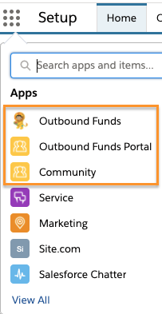

# dev story

This is the story we tell for developers building the Outbound Funds Site package.

## Steps

### Fundseeker Customer Enablement

We want to develop in orgs that mirror the installers as much as possible, so the first customization in the dev story is to run the `fundseeker_customer_enablement` flow that is used by our MetaDeploy installers.

### Secure OWDs by default

Trust is our #1 value, so the dev story sets both internal and external organization-wide defaults (OWDs) to `Private` meaning we have to explicitly grant sharing access to all records through some mechanism.

### Deploy unpackaged metadata

The following unpackaged metadata is deployed to configure the org to tell the dev story.

#### Funding Programs

The following are unpackaged configuration of the org to easily develop the unauthenticated/site guest user experience.

-   Adds `PubliclyAccessible__c` checkbox that grants sharing access to the Funding Program record via Sharing Rules.
-   Updated search layouts so `PubliclyAccessible__c` is shown on the **Recently Viewed** List View.
-   Adds `PubliclyAccessible__c` to the `outfunds__Funding_Program__c.outfunds__Funding Program Layout` Layout so internal users can see access this field.
-   Grants the **System Administrator** Profile field-level security to `PubliclyAccessible__c`.
-   Adds Sharing Rules to grant access to the following for Funding Programs records whose `PubliclyAccessible__c` is checked:
    -   **Fundseeker Portal** Site Guest User (i.e. unauthenticated site users)
    -   **All Customer Portal Users** (i.e. authenticated site users)

### Reorders the App Menu

To save clicks, reorders the App Menu to place Outbound Funds and Community apps first.

### Loads storytelling data

Loads storytelling data to tell the dev story.

### Updates the default scratch org user

To tell the admin part of the dev story, updates the default scratch org user as **Aileen Davis**.

### Create site users

To tell the fundseeker part of the dev story, creates site users using the **Fundseeker Plus Login** profile.

### Uploads user photos

Uploads photos for the following users:

-   Admin **Aileen Davis**
-   Fundseeker **Grace Walker**

### Shares Funding Programs to Accounts with Funding Requests

If an acccount has a Funding Request, that site users for that account should be able to view the Funding Program record.

This is accomplished by creating manual Funding Program share records to an account's Portal User and Subordinates for all Funding Programs where the account has a Funding Request (via `outfunds__Funding_Request__c.outfunds__Applying_Organization__c`).

The manual sharing is only applied to Funding Programs and Funding Requests storytelling data inserted in to the org. Manual share records will **not** automatically be created for new records.
